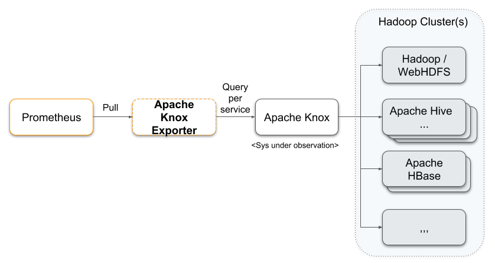
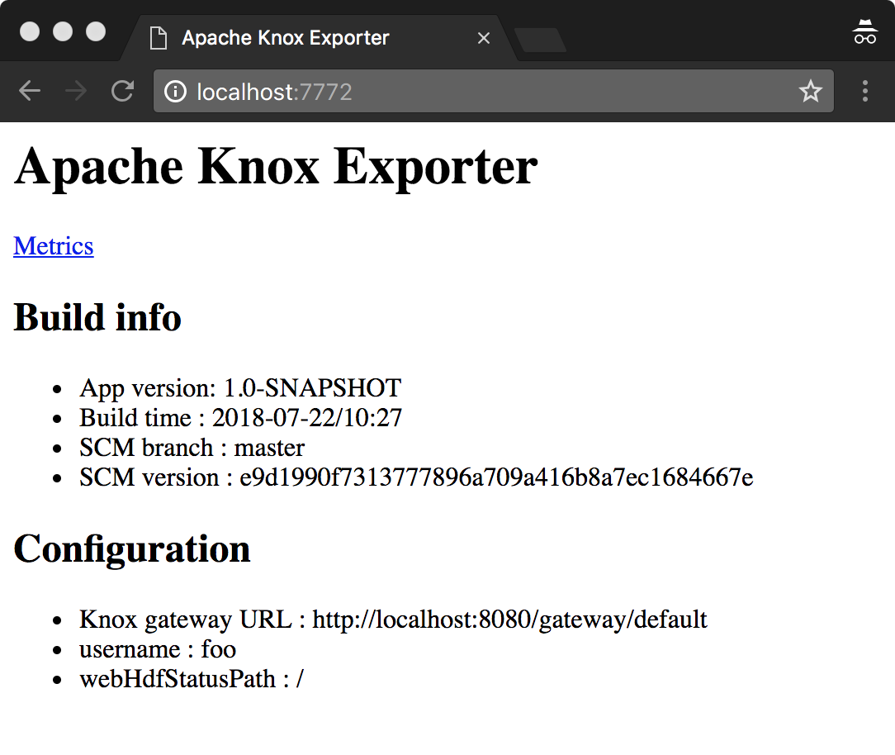

Prometheus Apache Knox Exporter
=======

[](http://search.maven.org/#search%7Cga%7C1%7Cg%3A%22de.m3y.prometheus.exporter.knox%22%20AND%20a%3A%22knox-exporter%22)

A [Prometheus](https://prometheus.io/) black box probe for [Apache Knox](http://knox.apache.org) supporting requests for
* WebHDFS status
* Hive query
* HBase status
    
The exporter collects per request
* the error count 
* the duration as summary with 0.5/0.95/0.99 quantiles

The exporter runs the requests towards the Knox proxied Hadoop services in parallel and enforces configurable timeouts.



## Roadmap

See [issues](../../issues)

## Requirements
For building:
* JDK 8
* [Maven 3.5.x](http://maven.apache.org)

For running:
* JRE 8 for running
* Tested with Knox 1.1/0.12 and Hive JDBC 1.2.2

## Downloading

Available on [](http://search.maven.org/#search%7Cga%7C1%7Cg%3A%22de.m3y.prometheus.exporter.knox%22%20AND%20a%3A%22knox-exporter%22)

## Building

```mvn clean install```

## Installation and configuration

* Download JAR from [](http://search.maven.org/#search%7Cga%7C1%7Cg%3A%22de.m3y.prometheus.exporter.knox%22%20AND%20a%3A%22knox-exporter%22)

* Configure the exporter     
  Create a yml file (see [example.yml](example.yml)):
  ```
  # Default User for connecting to Knox
  defaultUsername : 'foo'
  # Default password for authenticating Knox user.
  # Protect this config file read access with file permissions!
  defaultPassword : '***'
  # Timeout in seconds
  timeout: 50
  # Global JDBC Driver login timeout in seconds
  jdbcLoginTimeout : 10
  
  # A list of WebHDFS services 
  webHdfsServices:
  - knoxUrl: 'https://localhost:8443/gateway/default'
    # WebHDFS STATUS call directory or file path
    statusPaths: ['/']
  
  # A list of Hive services
  hiveServices:
  # Hive JDBC URL
  - jdbcUrl: 'jdbc:hive2://localhost:10000/default'
    # One or more Hive Queries
    queries: ['SELECT current_database()']

  # One or more HBase endpoints. Performs a status operation.
  hbaseServices:
  - knoxUrl: 'https://my-knox-server/gateway/default'
  ```

  The exporter uses [Knox Shell](https://knox.apache.org/books/knox-1-1-0/user-guide.html#Client+DSL+and+SDK+Details)
  for accessing Knox, and [Hive JDBC](https://cwiki.apache.org/confluence/display/Hive/HiveServer2+Clients#HiveServer2Clients-JDBC).

  Use the following Knox [environment variables](https://knox.apache.org/books/knox-1-1-0/user-guide.html#Basics)
  for configuring TLS and Knox/WebHDFS (if not trusted by JDK):
  * KNOX_CLIENT_TRUSTSTORE_DIR - the directory path to your JSK containing the Knox certificate
  * KNOX_CLIENT_TRUSTSTORE_FILENAME - the JKS filename
  * KNOX_CLIENT_TRUSTSTORE_PASS - the JKS pass phrase
 
* Run the exporter
  ```
    > java -jar knox-exporter-<VERSION>.jar
    Usage: WebServer [-Dlog.level=[WARN|INFO|DEBUG]] <hostname> <port> <knox gateway url> <yml configuration file>
  ```
  Note: Log level INFO is the default

  Example including JVM opts:
  ```
  > java -Xmx256m -server \
         -jar knox-exporter-1.0-SNAPSHOT.jar \
         0.0.0.0 9092 http://localhost:8080/gateway/default example.yml
  ```
  
* Test the exporter  
  Open http://\<hostname>:\<port>/metrics or http://\<hostname>:\<port>/ (for configuration overview)
   
* Add to prometheus
  ```
  - job_name: 'knox'
      scrape_interval: 30s
      scrape_timeout:  20s
      static_configs:
        - targets: ['<exporter hostname>:<exporter port>']
          labels:
            ...
  ```
## Metrics

| Name | Type | Description |
|------|------|-------|
| knox_exporter_ops_duration | Summary | Duration of a request to Hive or WebHDFS, including percentiles |
| knox_exporter_ops_errors_total | Counter | Errors of a request to Hive or WebHDFS |
| knox_exporter_scrape_duration_seconds | Gauge | Total duration of a scrape request (includes all hive and WebHDFS requests) |
| knox_exporter_scrape_requests_total | Counter | Total number of scrape requests to this exporter |
| knox_exporter_app_info | Gauge | Exporter info such as version, build time etc |

See the [example metrics](#example-metrics) output below.

## Example output

### Example home output



### Example metrics
Here's an example output:

```
# HELP knox_exporter_scrape_duration_seconds Scrape duration
# TYPE knox_exporter_scrape_duration_seconds gauge
knox_exporter_scrape_duration_seconds 0.514079402
# HELP knox_exporter_scrape_requests_total Exporter requests made
# TYPE knox_exporter_scrape_requests_total counter
knox_exporter_scrape_requests_total 1.0
# HELP knox_exporter_ops_errors_total Counts errors.
# TYPE knox_exporter_ops_errors_total counter
knox_exporter_ops_errors_total{action="hive_query",uri="jdbc:hive2://knox-hive-server:10000/default",user="foo-2",param="SELECT current_database()",} 0.0
knox_exporter_ops_errors_total{action="hive_query",uri="jdbc:hive2://knox-hive-server:10000/default",user="foo-2",param="something more complex",} 0.0
knox_exporter_ops_errors_total{action="webhdfs_status",uri="https://my-knox-server/gateway/another-cluster",user="foo",param="/",} 1.0
knox_exporter_ops_errors_total{action="hbase_status",uri="https://my-knox-server/gateway/default",user="foo",param="-",} 1.0
knox_exporter_ops_errors_total{action="webhdfs_status",uri="https://my-knox-server/gateway/default",user="foo",param="/datalake",} 1.0
knox_exporter_ops_errors_total{action="hive_query",uri="jdbc:hive2://knox-hive-server:10000/other-database",user="foo",param="SELECT current_database()",} 0.0
knox_exporter_ops_errors_total{action="webhdfs_status",uri="https://my-knox-server/gateway/default",user="foo",param="/",} 1.0
# HELP knox_exporter_ops_duration_seconds Ops duration
# TYPE knox_exporter_ops_duration_seconds summary
knox_exporter_ops_duration_seconds{action="hive_query",uri="jdbc:hive2://knox-hive-server:10000/default",user="foo-2",param="SELECT current_database()",quantile="0.5",} 0.019994329
knox_exporter_ops_duration_seconds{action="hive_query",uri="jdbc:hive2://knox-hive-server:10000/default",user="foo-2",param="SELECT current_database()",quantile="0.95",} 0.019994329
knox_exporter_ops_duration_seconds{action="hive_query",uri="jdbc:hive2://knox-hive-server:10000/default",user="foo-2",param="SELECT current_database()",quantile="0.99",} 0.019994329
knox_exporter_ops_duration_seconds_count{action="hive_query",uri="jdbc:hive2://knox-hive-server:10000/default",user="foo-2",param="SELECT current_database()",} 1.0
knox_exporter_ops_duration_seconds_sum{action="hive_query",uri="jdbc:hive2://knox-hive-server:10000/default",user="foo-2",param="SELECT current_database()",} 0.019994329
knox_exporter_ops_duration_seconds{action="hive_query",uri="jdbc:hive2://knox-hive-server:10000/default",user="foo-2",param="something more complex",quantile="0.5",} 0.020195183
knox_exporter_ops_duration_seconds{action="hive_query",uri="jdbc:hive2://knox-hive-server:10000/default",user="foo-2",param="something more complex",quantile="0.95",} 0.020195183
knox_exporter_ops_duration_seconds{action="hive_query",uri="jdbc:hive2://knox-hive-server:10000/default",user="foo-2",param="something more complex",quantile="0.99",} 0.020195183
knox_exporter_ops_duration_seconds_count{action="hive_query",uri="jdbc:hive2://knox-hive-server:10000/default",user="foo-2",param="something more complex",} 1.0
knox_exporter_ops_duration_seconds_sum{action="hive_query",uri="jdbc:hive2://knox-hive-server:10000/default",user="foo-2",param="something more complex",} 0.020195183
knox_exporter_ops_duration_seconds{action="webhdfs_status",uri="https://my-knox-server/gateway/another-cluster",user="foo",param="/",quantile="0.5",} 0.510275706
knox_exporter_ops_duration_seconds{action="webhdfs_status",uri="https://my-knox-server/gateway/another-cluster",user="foo",param="/",quantile="0.95",} 0.510275706
knox_exporter_ops_duration_seconds{action="webhdfs_status",uri="https://my-knox-server/gateway/another-cluster",user="foo",param="/",quantile="0.99",} 0.510275706
knox_exporter_ops_duration_seconds_count{action="webhdfs_status",uri="https://my-knox-server/gateway/another-cluster",user="foo",param="/",} 1.0
knox_exporter_ops_duration_seconds_sum{action="webhdfs_status",uri="https://my-knox-server/gateway/another-cluster",user="foo",param="/",} 0.510275706
knox_exporter_ops_duration_seconds{action="hbase_status",uri="https://my-knox-server/gateway/default",user="foo",param="-",quantile="0.5",} 0.51025998
knox_exporter_ops_duration_seconds{action="hbase_status",uri="https://my-knox-server/gateway/default",user="foo",param="-",quantile="0.95",} 0.51025998
knox_exporter_ops_duration_seconds{action="hbase_status",uri="https://my-knox-server/gateway/default",user="foo",param="-",quantile="0.99",} 0.51025998
knox_exporter_ops_duration_seconds_count{action="hbase_status",uri="https://my-knox-server/gateway/default",user="foo",param="-",} 1.0
knox_exporter_ops_duration_seconds_sum{action="hbase_status",uri="https://my-knox-server/gateway/default",user="foo",param="-",} 0.51025998
knox_exporter_ops_duration_seconds{action="hive_query",uri="jdbc:hive2://knox-hive-server:10000/other-database",user="foo",param="SELECT current_database()",quantile="0.5",} 0.02009303
knox_exporter_ops_duration_seconds{action="hive_query",uri="jdbc:hive2://knox-hive-server:10000/other-database",user="foo",param="SELECT current_database()",quantile="0.95",} 0.02009303
knox_exporter_ops_duration_seconds{action="hive_query",uri="jdbc:hive2://knox-hive-server:10000/other-database",user="foo",param="SELECT current_database()",quantile="0.99",} 0.02009303
knox_exporter_ops_duration_seconds_count{action="hive_query",uri="jdbc:hive2://knox-hive-server:10000/other-database",user="foo",param="SELECT current_database()",} 1.0
knox_exporter_ops_duration_seconds_sum{action="hive_query",uri="jdbc:hive2://knox-hive-server:10000/other-database",user="foo",param="SELECT current_database()",} 0.02009303
knox_exporter_ops_duration_seconds{action="webhdfs_status",uri="https://my-knox-server/gateway/default",user="foo",param="/datalake",quantile="0.5",} 0.510223914
knox_exporter_ops_duration_seconds{action="webhdfs_status",uri="https://my-knox-server/gateway/default",user="foo",param="/datalake",quantile="0.95",} 0.510223914
knox_exporter_ops_duration_seconds{action="webhdfs_status",uri="https://my-knox-server/gateway/default",user="foo",param="/datalake",quantile="0.99",} 0.510223914
knox_exporter_ops_duration_seconds_count{action="webhdfs_status",uri="https://my-knox-server/gateway/default",user="foo",param="/datalake",} 1.0
knox_exporter_ops_duration_seconds_sum{action="webhdfs_status",uri="https://my-knox-server/gateway/default",user="foo",param="/datalake",} 0.510223914
knox_exporter_ops_duration_seconds{action="webhdfs_status",uri="https://my-knox-server/gateway/default",user="foo",param="/",quantile="0.5",} 0.510247134
knox_exporter_ops_duration_seconds{action="webhdfs_status",uri="https://my-knox-server/gateway/default",user="foo",param="/",quantile="0.95",} 0.510247134
knox_exporter_ops_duration_seconds{action="webhdfs_status",uri="https://my-knox-server/gateway/default",user="foo",param="/",quantile="0.99",} 0.510247134
knox_exporter_ops_duration_seconds_count{action="webhdfs_status",uri="https://my-knox-server/gateway/default",user="foo",param="/",} 1.0
knox_exporter_ops_duration_seconds_sum{action="webhdfs_status",uri="https://my-knox-server/gateway/default",user="foo",param="/",} 0.510247134
# HELP jvm_memory_bytes_used Used bytes of a given JVM memory area.
# TYPE jvm_memory_bytes_used gauge
jvm_memory_bytes_used{area="heap",} 2.42938E7
jvm_memory_bytes_used{area="nonheap",} 2.2678856E7
# HELP jvm_memory_bytes_committed Committed (bytes) of a given JVM memory area.
# TYPE jvm_memory_bytes_committed gauge
jvm_memory_bytes_committed{area="heap",} 1.28974848E8
jvm_memory_bytes_committed{area="nonheap",} 2.3461888E7
# HELP jvm_memory_bytes_max Max (bytes) of a given JVM memory area.
# TYPE jvm_memory_bytes_max gauge
jvm_memory_bytes_max{area="heap",} 1.908932608E9
jvm_memory_bytes_max{area="nonheap",} -1.0
# HELP jvm_memory_bytes_init Initial bytes of a given JVM memory area.
# TYPE jvm_memory_bytes_init gauge
jvm_memory_bytes_init{area="heap",} 1.34217728E8
jvm_memory_bytes_init{area="nonheap",} 2555904.0
# HELP jvm_memory_pool_bytes_used Used bytes of a given JVM memory pool.
# TYPE jvm_memory_pool_bytes_used gauge
jvm_memory_pool_bytes_used{pool="Code Cache",} 4552064.0
jvm_memory_pool_bytes_used{pool="Metaspace",} 1.6239248E7
jvm_memory_pool_bytes_used{pool="Compressed Class Space",} 1887544.0
jvm_memory_pool_bytes_used{pool="PS Eden Space",} 1.6836576E7
jvm_memory_pool_bytes_used{pool="PS Survivor Space",} 5226528.0
jvm_memory_pool_bytes_used{pool="PS Old Gen",} 2230696.0
# HELP jvm_memory_pool_bytes_committed Committed bytes of a given JVM memory pool.
# TYPE jvm_memory_pool_bytes_committed gauge
jvm_memory_pool_bytes_committed{pool="Code Cache",} 4587520.0
jvm_memory_pool_bytes_committed{pool="Metaspace",} 1.6777216E7
jvm_memory_pool_bytes_committed{pool="Compressed Class Space",} 2097152.0
jvm_memory_pool_bytes_committed{pool="PS Eden Space",} 3.407872E7
jvm_memory_pool_bytes_committed{pool="PS Survivor Space",} 5242880.0
jvm_memory_pool_bytes_committed{pool="PS Old Gen",} 8.9653248E7
# HELP jvm_memory_pool_bytes_max Max bytes of a given JVM memory pool.
# TYPE jvm_memory_pool_bytes_max gauge
jvm_memory_pool_bytes_max{pool="Code Cache",} 2.5165824E8
jvm_memory_pool_bytes_max{pool="Metaspace",} -1.0
jvm_memory_pool_bytes_max{pool="Compressed Class Space",} 1.073741824E9
jvm_memory_pool_bytes_max{pool="PS Eden Space",} 7.0516736E8
jvm_memory_pool_bytes_max{pool="PS Survivor Space",} 5242880.0
jvm_memory_pool_bytes_max{pool="PS Old Gen",} 1.431830528E9
# HELP jvm_memory_pool_bytes_init Initial bytes of a given JVM memory pool.
# TYPE jvm_memory_pool_bytes_init gauge
jvm_memory_pool_bytes_init{pool="Code Cache",} 2555904.0
jvm_memory_pool_bytes_init{pool="Metaspace",} 0.0
jvm_memory_pool_bytes_init{pool="Compressed Class Space",} 0.0
jvm_memory_pool_bytes_init{pool="PS Eden Space",} 3.407872E7
jvm_memory_pool_bytes_init{pool="PS Survivor Space",} 5242880.0
jvm_memory_pool_bytes_init{pool="PS Old Gen",} 8.9653248E7
# HELP knox_exporter_scrape_errors_total Counts failed scrapes.
# TYPE knox_exporter_scrape_errors_total counter
knox_exporter_scrape_errors_total 0.0
# HELP knox_exporter_app_info Application build info
# TYPE knox_exporter_app_info gauge
knox_exporter_app_info{appName="knox_exporter",appVersion="1.0-SNAPSHOT",buildTime="2018-08-03/09:18",buildScmVersion="0e0973603ec0b3e9bfabecd8a163bfc135a25bdd",buildScmBranch="master",} 1.0
```
## License

The Knox Exporter is released under the [Apache 2.0 license](LICENSE).

```
Copyright 2018 Marcel May

Licensed under the Apache License, Version 2.0 (the "License");
you may not use this file except in compliance with the License.
You may obtain a copy of the License at

http://www.apache.org/licenses/LICENSE-2.0

Unless required by applicable law or agreed to in writing, software
distributed under the License is distributed on an "AS IS" BASIS,
WITHOUT WARRANTIES OR CONDITIONS OF ANY KIND, either express or implied.
See the License for the specific language governing permissions and
limitations under the License.
```
