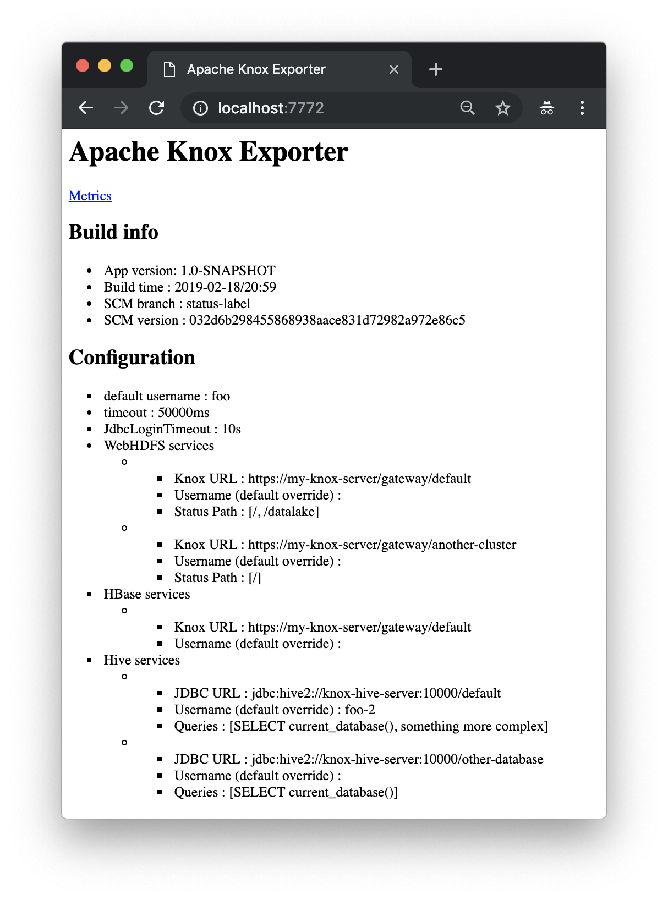

Prometheus Apache Knox Exporter
=======

[](http://search.maven.org/#search%7Cga%7C1%7Cg%3A%22de.m3y.prometheus.exporter.knox%22%20AND%20a%3A%22knox-exporter%22)

A [Prometheus](https://prometheus.io/) black box probe for [Apache Knox](http://knox.apache.org) supporting requests for
* WebHDFS status
* Hive query
* HBase status
    
The exporter collects per request
* the error count 
* the duration as summary with 0.5/0.95/0.99 quantiles

The exporter runs the requests towards the Knox proxied Hadoop services in parallel and enforces configurable timeouts.


## Roadmap

See [issues](../../issues)

## Requirements
For building:
* JDK 8
* [Maven 3.5.x](http://maven.apache.org)

For running:
* JRE 8 for running
* Tested with Knox 1.1/0.12 and Hive JDBC 1.2.2

## Downloading

Available on [](http://search.maven.org/#search%7Cga%7C1%7Cg%3A%22de.m3y.prometheus.exporter.knox%22%20AND%20a%3A%22knox-exporter%22)

## Building

```mvn clean install```

## Installation and configuration

* Download JAR from [](http://search.maven.org/#search%7Cga%7C1%7Cg%3A%22de.m3y.prometheus.exporter.knox%22%20AND%20a%3A%22knox-exporter%22)

* Configure the exporter     
  Create a yml file (see [example.yml](example.yml)):
  ```
  # Default User for connecting to Knox
  defaultUsername : 'foo'
  # Default password for authenticating Knox user.
  # Protect this config file read access with file permissions!
  defaultPassword : '***'
  # Timeout in milliseconds
  timeout: 50000
  # Global JDBC Driver login timeout in seconds
  jdbcLoginTimeout : 10
  
  # A list of WebHDFS services 
  webHdfsServices:
  - knoxUrl: 'https://localhost:8443/gateway/default'
    # WebHDFS STATUS call directory or file path
    statusPaths: ['/']
  
  # A list of Hive services
  hiveServices:
  # Hive JDBC URL
  - jdbcUrl: 'jdbc:hive2://localhost:10000/default'
    # One or more Hive Queries
    queries: ['SELECT current_database()']

  # One or more HBase endpoints. Performs a status operation.
  hbaseServices:
  - knoxUrl: 'https://my-knox-server/gateway/default'
  ```

  The exporter uses [Knox Shell](https://knox.apache.org/books/knox-1-1-0/user-guide.html#Client+DSL+and+SDK+Details)
  for accessing Knox, and [Hive JDBC](https://cwiki.apache.org/confluence/display/Hive/HiveServer2+Clients#HiveServer2Clients-JDBC).

  Use the following Knox [environment variables](https://knox.apache.org/books/knox-1-1-0/user-guide.html#Basics)
  for configuring TLS and Knox/WebHDFS (if not trusted by JDK):
  * KNOX_CLIENT_TRUSTSTORE_DIR - the directory path to your JSK containing the Knox certificate
  * KNOX_CLIENT_TRUSTSTORE_FILENAME - the JKS filename
  * KNOX_CLIENT_TRUSTSTORE_PASS - the JKS pass phrase
 
* Run the exporter
  ```
    > java -jar knox-exporter-<VERSION>.jar
    Usage: WebServer [-Dlog.level=[WARN|INFO|DEBUG]] <hostname> <port> <yml configuration file>
  ```
  Note: Log level INFO is the default

  Example including JVM opts:
  ```
  > java -Xmx256m -server \
         -jar knox-exporter-1.0-SNAPSHOT.jar \
         0.0.0.0 9092 example.yml
  ```
  
* Test the exporter  
  Open http://\<hostname>:\<port>/metrics or http://\<hostname>:\<port>/ (for configuration overview)
   
* Add to prometheus
  ```
  - job_name: 'knox'
      scrape_interval: 30s
      scrape_timeout:  20s
      static_configs:
        - targets: ['<exporter hostname>:<exporter port>']
          labels:
            ...
  ```
## Metrics

| Name | Type | Description | Example |
|------|------|-------------|---------|
| knox_exporter_ops_duration | Summary | Duration of a request to Hive or WebHDFS, including percentiles | knox_exporter_ops_duration_seconds{action="webhdfs_status",uri="https://my-knox-server/gateway/another-cluster",user="foo",param="/",status="ERROR_OTHER",quantile="0.5",} 0.004898905 <br> knox_exporter_ops_duration_seconds_count... <br> knox_exporter_ops_duration_seconds_sum... | 
| knox_exporter_ops_errors_total | Counter | Errors of a request to Hive or WebHDFS | knox_exporter_ops_errors_total{action="webhdfs_status",uri="https://my-knox-server/gateway/default",user="foo",param="/",status="SUCCESS",} 2.0 |
| knox_exporter_config_reloads_total | Counter | Total number of configuration reloads | knox_exporter_config_reloads_total 2.0 |
| knox_exporter_scrape_duration_seconds | Gauge | Total duration of a scrape request (includes all hive and WebHDFS requests) | knox_exporter_scrape_duration_seconds 0.005654917 |
| knox_exporter_scrape_requests_total | Counter | Total number of scrape requests to this exporter | knox_exporter_scrape_requests_total 2.0 |
| knox_exporter_app_info | Gauge | Exporter info such as version, build time etc | knox_exporter_app_info{appName="knox_exporter",appVersion="1.0-SNAPSHOT",buildTime="2019-02-18/20:59",buildScmVersion="032d6b298455868938aace831d72982a972e86c5",buildScmBranch="status-label",} 1.0 |

| Label | Description |
|-------|-------------|
| action | action type, such as `webhdfs_status`, `hbase_status`, `hive_query` |
| user | User for authentication |
| param | Action dependent additional parameter, such as path for HDFS status operation |
| status | Action result status, eg `UNKNOWN`,`SUCCESS`, `ERROR_AUTH`, `ERROR_TIMEOUT`, `ERROR_OTHER`  |

See the [example metrics](#example-metrics) output below.

## Example output

### Example home output



### Example metrics
Here's an example output:

```
# HELP process_cpu_seconds_total Total user and system CPU time spent in seconds.
# TYPE process_cpu_seconds_total counter
process_cpu_seconds_total 1.826615
# HELP process_start_time_seconds Start time of the process since unix epoch in seconds.
# TYPE process_start_time_seconds gauge
process_start_time_seconds 1.550525358565E9
# HELP process_open_fds Number of open file descriptors.
# TYPE process_open_fds gauge
process_open_fds 31.0
# HELP process_max_fds Maximum number of open file descriptors.
# TYPE process_max_fds gauge
process_max_fds 10240.0
# HELP jvm_buffer_pool_used_bytes Used bytes of a given JVM buffer pool.
# TYPE jvm_buffer_pool_used_bytes gauge
jvm_buffer_pool_used_bytes{pool="direct",} 45056.0
jvm_buffer_pool_used_bytes{pool="mapped",} 0.0
# HELP jvm_buffer_pool_capacity_bytes Bytes capacity of a given JVM buffer pool.
# TYPE jvm_buffer_pool_capacity_bytes gauge
jvm_buffer_pool_capacity_bytes{pool="direct",} 45056.0
jvm_buffer_pool_capacity_bytes{pool="mapped",} 0.0
# HELP jvm_buffer_pool_used_buffers Used buffers of a given JVM buffer pool.
# TYPE jvm_buffer_pool_used_buffers gauge
jvm_buffer_pool_used_buffers{pool="direct",} 3.0
jvm_buffer_pool_used_buffers{pool="mapped",} 0.0
# HELP knox_exporter_scrape_requests_total Exporter requests made
# TYPE knox_exporter_scrape_requests_total counter
knox_exporter_scrape_requests_total 2.0
# HELP knox_exporter_ops_duration_seconds Duration of successful and failed operations
# TYPE knox_exporter_ops_duration_seconds summary
knox_exporter_ops_duration_seconds{action="webhdfs_status",uri="https://my-knox-server/gateway/another-cluster",user="foo",param="/",status="ERROR_OTHER",quantile="0.5",} 0.004898905
knox_exporter_ops_duration_seconds{action="webhdfs_status",uri="https://my-knox-server/gateway/another-cluster",user="foo",param="/",status="ERROR_OTHER",quantile="0.95",} 0.004898905
knox_exporter_ops_duration_seconds{action="webhdfs_status",uri="https://my-knox-server/gateway/another-cluster",user="foo",param="/",status="ERROR_OTHER",quantile="0.99",} 0.004898905
knox_exporter_ops_duration_seconds{action="webhdfs_status",uri="https://my-knox-server/gateway/default",user="foo",param="/",status="ERROR_OTHER",quantile="0.5",} 0.004899220000000001
knox_exporter_ops_duration_seconds{action="webhdfs_status",uri="https://my-knox-server/gateway/default",user="foo",param="/",status="ERROR_OTHER",quantile="0.95",} 0.004899220000000001
knox_exporter_ops_duration_seconds{action="webhdfs_status",uri="https://my-knox-server/gateway/default",user="foo",param="/",status="ERROR_OTHER",quantile="0.99",} 0.004899220000000001
knox_exporter_ops_duration_seconds_count{action="webhdfs_status",uri="https://my-knox-server/gateway/another-cluster",user="foo",param="/",status="ERROR_OTHER",} 2.0
knox_exporter_ops_duration_seconds_sum{action="webhdfs_status",uri="https://my-knox-server/gateway/another-cluster",user="foo",param="/",status="ERROR_OTHER",} 0.32496299700000003
knox_exporter_ops_duration_seconds{action="hbase_status",uri="https://my-knox-server/gateway/default",user="foo",param="-",status="ERROR_OTHER",quantile="0.5",} 0.004860776
knox_exporter_ops_duration_seconds{action="hbase_status",uri="https://my-knox-server/gateway/default",user="foo",param="-",status="ERROR_OTHER",quantile="0.95",} 0.004860776
knox_exporter_ops_duration_seconds{action="hbase_status",uri="https://my-knox-server/gateway/default",user="foo",param="-",status="ERROR_OTHER",quantile="0.99",} 0.004860776
knox_exporter_ops_duration_seconds_count{action="hbase_status",uri="https://my-knox-server/gateway/default",user="foo",param="-",status="ERROR_OTHER",} 2.0
knox_exporter_ops_duration_seconds_sum{action="hbase_status",uri="https://my-knox-server/gateway/default",user="foo",param="-",status="ERROR_OTHER",} 0.324460022
knox_exporter_ops_duration_seconds_count{action="webhdfs_status",uri="https://my-knox-server/gateway/default",user="foo",param="/",status="ERROR_OTHER",} 2.0
knox_exporter_ops_duration_seconds_sum{action="webhdfs_status",uri="https://my-knox-server/gateway/default",user="foo",param="/",status="ERROR_OTHER",} 0.32494414599999993
knox_exporter_ops_duration_seconds{action="hive_query",uri="jdbc:hive2://knox-hive-server:10000/other-database",user="foo",param="SELECT current_database()",status="ERROR_OTHER",quantile="0.5",} 0.0010048869999999999
knox_exporter_ops_duration_seconds{action="hive_query",uri="jdbc:hive2://knox-hive-server:10000/other-database",user="foo",param="SELECT current_database()",status="ERROR_OTHER",quantile="0.95",} 0.0010048869999999999
knox_exporter_ops_duration_seconds{action="hive_query",uri="jdbc:hive2://knox-hive-server:10000/other-database",user="foo",param="SELECT current_database()",status="ERROR_OTHER",quantile="0.99",} 0.0010048869999999999
knox_exporter_ops_duration_seconds_count{action="hive_query",uri="jdbc:hive2://knox-hive-server:10000/other-database",user="foo",param="SELECT current_database()",status="ERROR_OTHER",} 2.0
knox_exporter_ops_duration_seconds_sum{action="hive_query",uri="jdbc:hive2://knox-hive-server:10000/other-database",user="foo",param="SELECT current_database()",status="ERROR_OTHER",} 0.015128614
knox_exporter_ops_duration_seconds{action="hive_query",uri="jdbc:hive2://knox-hive-server:10000/default",user="foo-2",param="SELECT current_database()",status="ERROR_OTHER",quantile="0.5",} 8.978400000000001E-4
knox_exporter_ops_duration_seconds{action="hive_query",uri="jdbc:hive2://knox-hive-server:10000/default",user="foo-2",param="SELECT current_database()",status="ERROR_OTHER",quantile="0.95",} 8.978400000000001E-4
knox_exporter_ops_duration_seconds{action="hive_query",uri="jdbc:hive2://knox-hive-server:10000/default",user="foo-2",param="SELECT current_database()",status="ERROR_OTHER",quantile="0.99",} 8.978400000000001E-4
knox_exporter_ops_duration_seconds_count{action="hive_query",uri="jdbc:hive2://knox-hive-server:10000/default",user="foo-2",param="SELECT current_database()",status="ERROR_OTHER",} 2.0
knox_exporter_ops_duration_seconds_sum{action="hive_query",uri="jdbc:hive2://knox-hive-server:10000/default",user="foo-2",param="SELECT current_database()",status="ERROR_OTHER",} 0.015223205
knox_exporter_ops_duration_seconds{action="webhdfs_status",uri="https://my-knox-server/gateway/default",user="foo",param="/datalake",status="ERROR_OTHER",quantile="0.5",} 0.005041093
knox_exporter_ops_duration_seconds{action="webhdfs_status",uri="https://my-knox-server/gateway/default",user="foo",param="/datalake",status="ERROR_OTHER",quantile="0.95",} 0.005041093
knox_exporter_ops_duration_seconds{action="webhdfs_status",uri="https://my-knox-server/gateway/default",user="foo",param="/datalake",status="ERROR_OTHER",quantile="0.99",} 0.005041093
knox_exporter_ops_duration_seconds_count{action="webhdfs_status",uri="https://my-knox-server/gateway/default",user="foo",param="/datalake",status="ERROR_OTHER",} 2.0
knox_exporter_ops_duration_seconds_sum{action="webhdfs_status",uri="https://my-knox-server/gateway/default",user="foo",param="/datalake",status="ERROR_OTHER",} 0.325166978
knox_exporter_ops_duration_seconds{action="hive_query",uri="jdbc:hive2://knox-hive-server:10000/default",user="foo-2",param="something more complex",status="ERROR_OTHER",quantile="0.5",} 9.689500000000001E-4
knox_exporter_ops_duration_seconds{action="hive_query",uri="jdbc:hive2://knox-hive-server:10000/default",user="foo-2",param="something more complex",status="ERROR_OTHER",quantile="0.95",} 9.689500000000001E-4
knox_exporter_ops_duration_seconds{action="hive_query",uri="jdbc:hive2://knox-hive-server:10000/default",user="foo-2",param="something more complex",status="ERROR_OTHER",quantile="0.99",} 9.689500000000001E-4
knox_exporter_ops_duration_seconds_count{action="hive_query",uri="jdbc:hive2://knox-hive-server:10000/default",user="foo-2",param="something more complex",status="ERROR_OTHER",} 2.0
knox_exporter_ops_duration_seconds_sum{action="hive_query",uri="jdbc:hive2://knox-hive-server:10000/default",user="foo-2",param="something more complex",status="ERROR_OTHER",} 0.015154797
# HELP jvm_memory_bytes_used Used bytes of a given JVM memory area.
# TYPE jvm_memory_bytes_used gauge
jvm_memory_bytes_used{area="heap",} 2.7190112E7
jvm_memory_bytes_used{area="nonheap",} 2.2831256E7
# HELP jvm_memory_bytes_committed Committed (bytes) of a given JVM memory area.
# TYPE jvm_memory_bytes_committed gauge
jvm_memory_bytes_committed{area="heap",} 1.28974848E8
jvm_memory_bytes_committed{area="nonheap",} 2.359296E7
# HELP jvm_memory_bytes_max Max (bytes) of a given JVM memory area.
# TYPE jvm_memory_bytes_max gauge
jvm_memory_bytes_max{area="heap",} 1.28974848E8
jvm_memory_bytes_max{area="nonheap",} -1.0
# HELP jvm_memory_bytes_init Initial bytes of a given JVM memory area.
# TYPE jvm_memory_bytes_init gauge
jvm_memory_bytes_init{area="heap",} 1.34217728E8
jvm_memory_bytes_init{area="nonheap",} 2555904.0
# HELP jvm_memory_pool_bytes_used Used bytes of a given JVM memory pool.
# TYPE jvm_memory_pool_bytes_used gauge
jvm_memory_pool_bytes_used{pool="Code Cache",} 4405376.0
jvm_memory_pool_bytes_used{pool="Metaspace",} 1.6489216E7
jvm_memory_pool_bytes_used{pool="Compressed Class Space",} 1936664.0
jvm_memory_pool_bytes_used{pool="PS Eden Space",} 1.96752E7
jvm_memory_pool_bytes_used{pool="PS Survivor Space",} 5210144.0
jvm_memory_pool_bytes_used{pool="PS Old Gen",} 2304768.0
# HELP jvm_memory_pool_bytes_committed Committed bytes of a given JVM memory pool.
# TYPE jvm_memory_pool_bytes_committed gauge
jvm_memory_pool_bytes_committed{pool="Code Cache",} 4456448.0
jvm_memory_pool_bytes_committed{pool="Metaspace",} 1.703936E7
jvm_memory_pool_bytes_committed{pool="Compressed Class Space",} 2097152.0
jvm_memory_pool_bytes_committed{pool="PS Eden Space",} 3.407872E7
jvm_memory_pool_bytes_committed{pool="PS Survivor Space",} 5242880.0
jvm_memory_pool_bytes_committed{pool="PS Old Gen",} 8.9653248E7
# HELP jvm_memory_pool_bytes_max Max bytes of a given JVM memory pool.
# TYPE jvm_memory_pool_bytes_max gauge
jvm_memory_pool_bytes_max{pool="Code Cache",} 2.5165824E8
jvm_memory_pool_bytes_max{pool="Metaspace",} -1.0
jvm_memory_pool_bytes_max{pool="Compressed Class Space",} 1.073741824E9
jvm_memory_pool_bytes_max{pool="PS Eden Space",} 3.407872E7
jvm_memory_pool_bytes_max{pool="PS Survivor Space",} 5242880.0
jvm_memory_pool_bytes_max{pool="PS Old Gen",} 8.9653248E7
# HELP jvm_memory_pool_bytes_init Initial bytes of a given JVM memory pool.
# TYPE jvm_memory_pool_bytes_init gauge
jvm_memory_pool_bytes_init{pool="Code Cache",} 2555904.0
jvm_memory_pool_bytes_init{pool="Metaspace",} 0.0
jvm_memory_pool_bytes_init{pool="Compressed Class Space",} 0.0
jvm_memory_pool_bytes_init{pool="PS Eden Space",} 3.407872E7
jvm_memory_pool_bytes_init{pool="PS Survivor Space",} 5242880.0
jvm_memory_pool_bytes_init{pool="PS Old Gen",} 8.9653248E7
# HELP knox_exporter_scrape_duration_seconds Scrape duration
# TYPE knox_exporter_scrape_duration_seconds gauge
knox_exporter_scrape_duration_seconds 0.005654917
# HELP jvm_threads_current Current thread count of a JVM
# TYPE jvm_threads_current gauge
jvm_threads_current 19.0
# HELP jvm_threads_daemon Daemon thread count of a JVM
# TYPE jvm_threads_daemon gauge
jvm_threads_daemon 3.0
# HELP jvm_threads_peak Peak thread count of a JVM
# TYPE jvm_threads_peak gauge
jvm_threads_peak 19.0
# HELP jvm_threads_started_total Started thread count of a JVM
# TYPE jvm_threads_started_total counter
jvm_threads_started_total 19.0
# HELP jvm_threads_deadlocked Cycles of JVM-threads that are in deadlock waiting to acquire object monitors or ownable synchronizers
# TYPE jvm_threads_deadlocked gauge
jvm_threads_deadlocked 0.0
# HELP jvm_threads_deadlocked_monitor Cycles of JVM-threads that are in deadlock waiting to acquire object monitors
# TYPE jvm_threads_deadlocked_monitor gauge
jvm_threads_deadlocked_monitor 0.0
# HELP jvm_threads_state Current count of threads by state
# TYPE jvm_threads_state gauge
jvm_threads_state{state="RUNNABLE",} 6.0
jvm_threads_state{state="NEW",} 0.0
jvm_threads_state{state="TIMED_WAITING",} 1.0
jvm_threads_state{state="BLOCKED",} 2.0
jvm_threads_state{state="TERMINATED",} 0.0
jvm_threads_state{state="WAITING",} 10.0
# HELP jvm_gc_collection_seconds Time spent in a given JVM garbage collector in seconds.
# TYPE jvm_gc_collection_seconds summary
jvm_gc_collection_seconds_count{gc="PS Scavenge",} 1.0
jvm_gc_collection_seconds_sum{gc="PS Scavenge",} 0.004
jvm_gc_collection_seconds_count{gc="PS MarkSweep",} 0.0
jvm_gc_collection_seconds_sum{gc="PS MarkSweep",} 0.0
# HELP jvm_info JVM version info
# TYPE jvm_info gauge
jvm_info{version="1.8.0_202-b08",vendor="Oracle Corporation",runtime="Java(TM) SE Runtime Environment",} 1.0
# HELP knox_exporter_scrape_errors_total Counts failed scrapes.
# TYPE knox_exporter_scrape_errors_total counter
knox_exporter_scrape_errors_total 0.0
# HELP jvm_memory_pool_allocated_bytes_total Total bytes allocated in a given JVM memory pool. Only updated after GC, not continuously.
# TYPE jvm_memory_pool_allocated_bytes_total counter
# HELP knox_exporter_app_info Application build info
# TYPE knox_exporter_app_info gauge
knox_exporter_app_info{appName="knox_exporter",appVersion="1.0-SNAPSHOT",buildTime="2019-02-18/20:59",buildScmVersion="032d6b298455868938aace831d72982a972e86c5",buildScmBranch="status-label",} 1.0
# HELP knox_exporter_ops_errors_total Ops error counts.
# TYPE knox_exporter_ops_errors_total counter
knox_exporter_ops_errors_total{action="webhdfs_status",uri="https://my-knox-server/gateway/default",user="foo",param="/",status="ERROR_OTHER",} 0.0
knox_exporter_ops_errors_total{action="webhdfs_status",uri="https://my-knox-server/gateway/another-cluster",user="foo",param="/",status="ERROR_OTHER",} 2.0
knox_exporter_ops_errors_total{action="hive_query",uri="jdbc:hive2://knox-hive-server:10000/default",user="foo-2",param="something more complex",status="ERROR_OTHER",} 0.0
knox_exporter_ops_errors_total{action="hive_query",uri="jdbc:hive2://knox-hive-server:10000/default",user="foo-2",param="something more complex",status="ERROR_OTHER",} 0.0
knox_exporter_ops_errors_total{action="hbase_status",uri="https://my-knox-server/gateway/default",user="foo",param="-",status="ERROR_OTHER",} 0.0
knox_exporter_ops_errors_total{action="hive_query",uri="jdbc:hive2://knox-hive-server:10000/default",user="foo-2",param="SELECT current_database()",status="ERROR_OTHER",} 2.0
knox_exporter_ops_errors_total{action="webhdfs_status",uri="https://my-knox-server/gateway/default",user="foo",param="/datalake",status="ERROR_OTHER",} 2.0
knox_exporter_ops_errors_total{action="hive_query",uri="jdbc:hive2://knox-hive-server:10000/other-database",user="foo",param="SELECT current_database()",status="ERROR_OTHER",} 0.0
knox_exporter_ops_errors_total{action="hive_query",uri="jdbc:hive2://knox-hive-server:10000/default",user="foo-2",param="something more complex",status="ERROR_OTHER",} 2.0
knox_exporter_ops_errors_total{action="hive_query",uri="jdbc:hive2://knox-hive-server:10000/other-database",user="foo",param="SELECT current_database()",status="ERROR_OTHER",} 0.0
knox_exporter_ops_errors_total{action="webhdfs_status",uri="https://my-knox-server/gateway/another-cluster",user="foo",param="/",status="ERROR_OTHER",} 0.0
knox_exporter_ops_errors_total{action="hbase_status",uri="https://my-knox-server/gateway/default",user="foo",param="-",status="ERROR_OTHER",} 2.0
knox_exporter_ops_errors_total{action="webhdfs_status",uri="https://my-knox-server/gateway/another-cluster",user="foo",param="/",status="ERROR_OTHER",} 0.0
knox_exporter_ops_errors_total{action="webhdfs_status",uri="https://my-knox-server/gateway/default",user="foo",param="/",status="ERROR_OTHER",} 2.0
knox_exporter_ops_errors_total{action="hive_query",uri="jdbc:hive2://knox-hive-server:10000/other-database",user="foo",param="SELECT current_database()",status="ERROR_OTHER",} 2.0
knox_exporter_ops_errors_total{action="hive_query",uri="jdbc:hive2://knox-hive-server:10000/default",user="foo-2",param="SELECT current_database()",status="ERROR_OTHER",} 0.0
knox_exporter_ops_errors_total{action="webhdfs_status",uri="https://my-knox-server/gateway/default",user="foo",param="/datalake",status="ERROR_OTHER",} 0.0
# HELP knox_exporter_config_reloads_total Number of configuration reloads
# TYPE knox_exporter_config_reloads_total counter
knox_exporter_config_reloads_total 0.0s
# HELP jvm_classes_loaded The number of classes that are currently loaded in the JVM
# TYPE jvm_classes_loaded gauge
jvm_classes_loaded 2851.0
# HELP jvm_classes_loaded_total The total number of classes that have been loaded since the JVM has started execution
# TYPE jvm_classes_loaded_total counter
jvm_classes_loaded_total 2851.0
# HELP jvm_classes_unloaded_total The total number of classes that have been unloaded since the JVM has started execution
# TYPE jvm_classes_unloaded_total counter
jvm_classes_unloaded_total 0.0
```
## License

The Knox Exporter is released under the [Apache 2.0 license](LICENSE).

```
Copyright 2018-2019 Marcel May

Licensed under the Apache License, Version 2.0 (the "License");
you may not use this file except in compliance with the License.
You may obtain a copy of the License at

http://www.apache.org/licenses/LICENSE-2.0

Unless required by applicable law or agreed to in writing, software
distributed under the License is distributed on an "AS IS" BASIS,
WITHOUT WARRANTIES OR CONDITIONS OF ANY KIND, either express or implied.
See the License for the specific language governing permissions and
limitations under the License.
```
